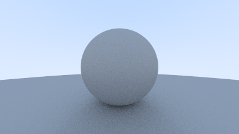

# Ray Tracer



A ray tracer implemented in Rust, inspired by the *Ray Tracing in One Weekend* book.
The project renders 3D scenes with spheres, materials, and basic shading.

## Features

- Ray-sphere intersection
- Configurable camera with perspective projection
- Reflections and Refractions
- Lambertian model of shading
- Multi Sampled Anti Aliasing
- Multiple surface materials such as: diffuse, metallic and dielectric.
- Depth of field
- Gradient Background
- Image output to PNG

## Getting Started

### Prerequisites

- Rust (install via [rustup](https://rustup.rs/))
- Cargo (comes with Rust)

### Build and Run

1. Clone the repository:

```shell
git clone https://github.com/AndreyVLD/RayTracer
cd RayTracer
```

2. Build and run the project:

```shell
cargo run
```

3. View the output image:

- The rendered scene is saved as `output.png` in the project directory.

## File Structure

- `src\`
    - `main.rs`: Entry point
    - `camera.rs`: Camera setup and ray generation
    - `ray.rs`: Ray struct and its implementation functions
    - `utils.rs`: Utility maths functions.
    - `vector3.rs`: 3D Vector struct and its implementation functions
    - `shapes\`
        - `hit.rs`: Struct for ray hits information and trait of hittable objects
        - `materials.rs`: Structs of surfaces used by hittable objects
        - `quad.rs`: In progress code for a 4-vertex figure implementation
        - `sphere.rs`: Sphere struct and its implementation functions
